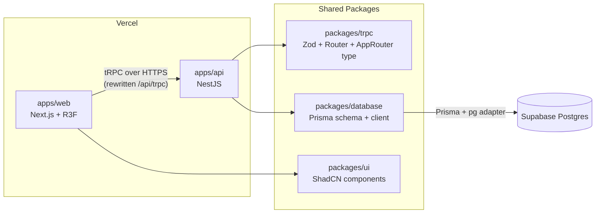
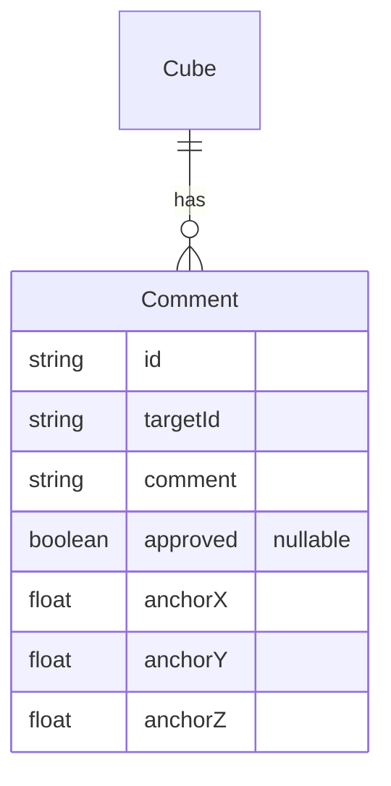
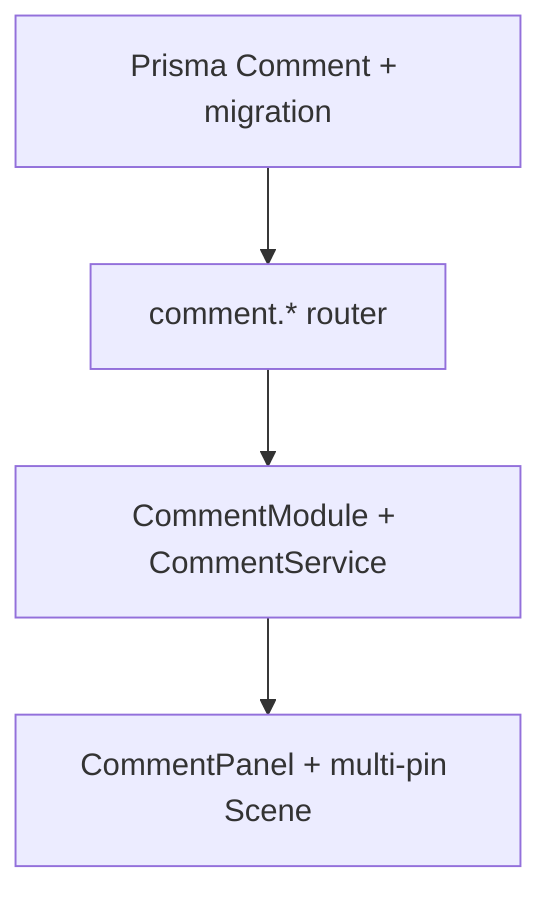
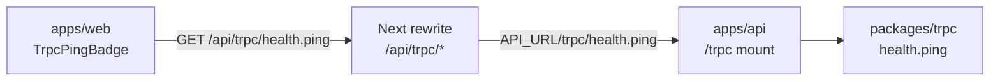
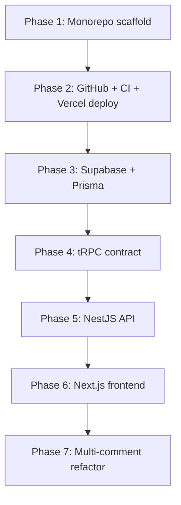

# CADchat Interview Exercise — Execution Plan

## PRD Summary

Build a 3D cube viewer where clicking the cube opens a Drei overlay to add and manage **multiple design comments** on the cube. Each comment is persisted with a 3D anchor and an `approved` value (`true` | `false` | `null`). Status is shown **per comment when opened** — `null` shows no badge (approve/reject available); `true`/`false` show Approved/Rejected. The frontend must **never** write to Supabase directly; all persistence goes through a Node.js API layer.

Your stack extends the PRD with: **Next.js**, **NestJS + Prisma + Zod**, **tRPC**, **Turborepo**, **ShadCN/Tailwind**, and **Vercel auto-deploy**.

---

## Target Architecture



**Key design choice:** Follow the [T3 Turbo monorepo pattern](https://github.com/t3-oss/create-t3-turbo) — the tRPC router and Zod schemas live in `packages/trpc`, while NestJS hosts the runtime, injects services via `createContext`, and mounts the router. This gives end-to-end type safety without importing NestJS code into the Next.js bundle.

---

## Monorepo Layout

```
cad-model-review-tool/
├── apps/
│   ├── web/                 # Next.js 15 App Router, R3F, tRPC client
│   └── api/                 # NestJS, tRPC mount, Prisma service layer
├── packages/
│   ├── database/            # Prisma schema, migrations, generated client
│   ├── trpc/                # Zod schemas, comment router, AppRouter export
│   ├── ui/                  # ShadCN primitives (Button, Textarea, Card, Badge)
│   ├── typescript-config/   # Shared tsconfig bases
│   └── eslint-config/       # Shared lint rules
├── turbo.json
├── pnpm-workspace.yaml
├── package.json
└── .github/workflows/ci.yml # Required: lint, typecheck, build, migrate deploy
```

**Package manager:** `pnpm` (Turborepo default, workspace protocol `workspace:*`).

---

## Phase 1 — Monorepo Scaffold ✅

1. Initialize root with Turborepo (`turbo.json` pipelines: `build`, `dev`, `lint`, `typecheck`, `db:generate`, `db:migrate`).
2. Create shared config packages (`typescript-config`, `eslint-config`).
3. Bootstrap `apps/web` via `create-next-app` (TypeScript, Tailwind, App Router, no src dir).
4. Bootstrap `apps/api` via `@nestjs/cli` with `src/main.ts` entrypoint ([required by Vercel NestJS detection](https://vercel.com/docs/frameworks/backend/nestjs)).
5. Add root scripts: `pnpm dev` runs both apps via Turbo.

**Turbo task dependencies (added as packages land in later phases):**
- `apps/api#build` depends on `packages/database#db:generate` and `packages/trpc#build`
- `apps/web#build` depends on `packages/trpc#build` and `packages/ui#build`

---

## Phase 2 — GitHub + Vercel Auto-Deploy + CI ✅

Establish the full deploy pipeline **before** building application features. Every subsequent phase pushes to `main` and validates against live CI/CD.

Per your preference: **create everything fresh via MCP**.

### GitHub (MCP: `create_repository`)

1. Create repo `cad-model-review-tool` (private recommended for interview)
2. Push monorepo scaffold with `.gitignore` covering `.env`, `node_modules`, `.turbo`, Prisma generated artifacts
3. Expand [`README.md`](README.md) with architecture overview and demo steps for interview presentation

### CI (required)

Add [`.github/workflows/ci.yml`](.github/workflows/ci.yml) immediately after the first push — not deferred.

**Triggers:** `push` to `main`, `pull_request` to `main`

**Jobs:**

1. **`quality`** — runs on every PR and push (works on Phase 1 scaffold immediately):
   - `pnpm install --frozen-lockfile`
   - `pnpm turbo lint typecheck build`

2. **`migrate`** — runs on push to `main` after `quality` passes:
   - `pnpm install --frozen-lockfile`
   - `pnpm --filter @repo/database exec prisma migrate deploy`
   - Uses `DIRECT_URL` from GitHub Actions secret (direct Postgres connection, not pooler)
   - **Conditional:** skip until `packages/database/prisma/migrations/` exists (Phase 3). The workflow file and secrets are wired in Phase 2; the job activates automatically once the first migration is committed.

**GitHub Actions secrets (configure in Phase 2, populate as services come online):**
- `DIRECT_URL` — Supabase direct connection string (required once migrate job activates in Phase 3)
- `DATABASE_URL` — pooler URL (used by build steps if needed)

**Branch protection (recommended):** Require the `quality` check to pass before merge.

### Vercel — Two projects from one repo ([monorepo docs](https://vercel.com/docs/monorepos))

| Project | Root Directory | Framework | Build Command |
|---------|---------------|-----------|---------------|
| `cmrt-web` | `apps/web` | Next.js | `cd ../.. && pnpm turbo build --filter=@repo/web` |
| `cmrt-api` | `apps/api` | NestJS | `cd ../.. && pnpm turbo build --filter=@repo/api` |

**MCP workflow:**
1. `list_teams` → select team
2. Link both projects to the GitHub repo (import twice, different root dirs)
3. Enable **Related Projects** so env vars can cross-reference URLs
4. Set environment variables per project (placeholder values OK until Phase 3):

**cmrt-api:**
- `DATABASE_URL` — Supabase pooler URL (Phase 3)
- `DIRECT_URL` — Supabase direct URL (Phase 3)
- `WEB_URL` — `https://cmrt-web-*.vercel.app`

**cmrt-web:**
- `API_URL` — `https://cmrt-api-*.vercel.app`

Both projects auto-deploy on push to `origin/main` via GitHub integration. Verify the scaffold deploys successfully before proceeding to Phase 3.

**Phase 2 exit criteria:**
- Push to `main` triggers `quality` CI job (green)
- Both Vercel projects deploy the scaffold (Next.js default page + NestJS hello endpoint)
- GitHub Actions secrets and Vercel env var slots are configured (values filled as needed in Phase 3)

---

## Phase 3 — Supabase Postgres + Prisma Migrate ✅

Use the **Supabase MCP** only for project provisioning and connection info (`create_project`, `get_project_url`). All schema changes are owned by **Prisma Migrate** — migration SQL files are committed to the repo and applied via `prisma migrate dev` locally and `prisma migrate deploy` in CI.

### Prisma setup in [`packages/database`](packages/database)

- `schema.prisma` with `Review` model and `ReviewStatus` enum (`pending`, `approved`, `rejected`)
- Prisma 7 with `@prisma/adapter-pg` + `pg` driver ([Prisma ORM docs](https://www.prisma.io/docs/orm))
- Two connection URLs:
  - `DATABASE_URL` — Supabase **transaction pooler** (port 6543, `?pgbouncer=true`) for Vercel serverless runtime
  - `DIRECT_URL` — direct connection (port 5432) for `prisma migrate dev` and `prisma migrate deploy`
- Export a singleton `PrismaClient` factory from `packages/database`

### Initial migration (via Prisma, not MCP)

1. Define the `Review` model in `schema.prisma`
2. Run `pnpm db:migrate` (`prisma migrate dev --name init_reviews`) against local/direct Supabase URL
3. Edit the generated migration SQL to append RLS hardening (Supabase skill checklist):

```sql
ALTER TABLE reviews ENABLE ROW LEVEL SECURITY;
-- No public policies: backend connects via Prisma using direct/service credentials
```

4. Commit `prisma/migrations/` to git — this is the single source of truth for schema history

**Supabase MCP workflow (provisioning only):**
1. `create_project` → new Supabase project
2. Copy `DATABASE_URL` (pooler) and `DIRECT_URL` (direct) into `.env`, GitHub Actions secrets, and Vercel env vars (already configured in Phase 2)
3. `get_advisors` after first migrate deploy to verify RLS/security posture
4. First push with `prisma/migrations/` activates the CI `migrate` job from Phase 2

---

## Phase 4 — tRPC Contract (`packages/trpc`) ✅

Define Zod 4 schemas ([zod.dev](https://zod.dev/)) and the router:

| Procedure | Type | Input | Output | Behavior |
|-----------|------|-------|--------|----------|
| `health.ping` | query | none | `{ ok: true, ts: number }` | Connectivity probe for frontend→backend verification |
| `review.get` | query | `{ targetId?: string }` | `Review \| null` | Fetch review for cube (default `default-cube`) |
| `review.create` | mutation | `{ comment: string }` | `Review` | Insert with `status: pending`; reject if review already exists |
| `review.approve` | mutation | `{ id: string }` | `Review` | Set `status: approved` (only if currently `pending`) |
| `review.reject` | mutation | `{ id: string }` | `Review` | Set `status: rejected` (only if currently `pending`) |

**Zod schemas** (shared, exported for reuse):
- `reviewSchema` — full review object
- `createReviewInputSchema`, `updateReviewStatusInputSchema`
- `reviewStatusSchema` — enum `pending | approved | rejected`

**Context interface:**
```typescript
type TrpcContext = { reviewService: ReviewServiceLike }
```

Export `type AppRouter = typeof appRouter` — consumed by Next.js client only as a type import.

**Phase 4 exit criteria (contract only — no live wire yet):**
- `pnpm turbo typecheck` passes for `@repo/trpc`
- Optional: `createCallerFactory` unit test confirms `health.ping` returns `{ ok: true, ts: number }`
- Does **not** prove NestJS mount or Next.js client — that requires Phases 5–6

---

## Phase 5 — NestJS API (`apps/api`) ✅

### Modules

- `PrismaModule` — wraps `packages/database` client
- `ReviewModule` — `ReviewService` with Prisma CRUD (maps to PRD requirement #3)
- `TrpcModule` — mounts tRPC at `/trpc`

### tRPC mount (manual Express middleware — proven monorepo pattern)

In [`apps/api/src/bootstrap.ts`](apps/api/src/bootstrap.ts):
1. Create NestJS app
2. Enable CORS for `WEB_URL` (needed for direct API calls in dev; mitigated in prod via Next.js rewrite)
3. After `app.init()`, mount:

```typescript
server.use('/trpc', trpcExpress.createExpressMiddleware({
  router: appRouter,
  createContext: ({ req, res }) => ({
    reviewService: app.get(ReviewService),
  }),
}));
```

**Mount `/trpc` and verify `health.ping` with curl before building ReviewService** — isolates wiring from DB logic:

```bash
curl -s "http://localhost:3001/trpc/health.ping"
```

Expected: `{ "result": { "data": { "json": { "ok": true, "ts": ... } } } }`

Production (with protection bypass if needed):

```bash
curl -s -H "x-vercel-protection-bypass: $API_PROTECTION_BYPASS" \
  "https://cmrt-api.vercel.app/trpc/health.ping"
```

### ReviewService responsibilities

- `findByTargetId(targetId)` → `Review | null`
- `create(comment)` → throws `CONFLICT` if review exists
- `updateStatus(id, status)` → validates current status is `pending`

Map Prisma errors to `TRPCError` codes for clean client handling.

**Phase 5 exit criteria:**
- `curl localhost:3001/trpc/health.ping` returns `{ ok: true, ts }`
- `review.*` procedures work against Supabase via Prisma

### Vercel readiness

- Entrypoint: `src/main.ts` (auto-detected by Vercel)
- `apps/api/vercel.json` only if needed beyond zero-config NestJS support
- Env vars: `DATABASE_URL`, `DIRECT_URL`, `WEB_URL`

---

## Phase 6 — Next.js Frontend (`apps/web`) ✅

### tRPC client + ping UI (do this before R3F scene) ✅

- `@trpc/client`, `@trpc/react-query`, `@tanstack/react-query`
- `lib/trpc/client.ts` — vanilla client for server components (if needed)
- `lib/trpc/react.tsx` — `createTRPCReact<AppRouter>()` + `TRPCProvider`
- Wrap root layout with `QueryClientProvider` + `TRPCProvider`

**API URL strategy (avoids CORS in production):**

[`apps/web/next.config.ts`](apps/web/next.config.ts) rewrite:
```typescript
async rewrites() {
  return [{
    source: '/api/trpc/:path*',
    destination: `${process.env.API_URL}/trpc/:path*`,
  }];
}
```

Client uses relative URL `/api/trpc` — works locally and on Vercel when `API_URL` points to the NestJS deployment.

**`TrpcPingBadge` — user-visible connectivity check**

Add a small client component on the home page (outside the R3F canvas):

| State | UI |
|-------|-----|
| Loading | "Checking API…" (muted) |
| Success | Green badge: `API connected · {ts}` |
| Error | Red badge: `API unreachable · {message}` |

```typescript
const { data, error, isLoading } = trpc.health.ping.useQuery();
```

This is the primary proof that frontend → Next rewrite → NestJS → tRPC is working. Build and verify the badge **before** the 3D scene to keep debugging isolated.

**Phase 6 ping exit criteria:**
1. Home page shows green `API connected` with timestamp when `pnpm dev` runs both apps
2. Same badge is green on deployed `cmrt-web` → `cmrt-api`
3. Stopping the API (or breaking `API_URL`) turns the badge red

### ShadCN + Tailwind ✅

- Initialize ShadCN in `packages/ui` (shared component library pattern)
- Install in web app: `Button`, `Textarea`, `Card`, `Badge`, `Label`
- Tailwind configured at root or per-package with shared preset

### 3D Viewer (PRD requirements #1, #4) ✅

Create client-only scene component (`dynamic(() => import('./Scene'), { ssr: false })`):

- `@react-three/fiber` `<Canvas>` with ambient + directional light, orbit controls
- Clickable `<mesh>` cube with `onClick` handler
- `@react-three/drei` `<Html center>` overlay positioned above cube when selected
- Overlay hosts `ReviewPanel` component wired to tRPC hooks:
  - **No review** → comment form + submit (`review.create`)
  - **Pending** → show comment + Approve/Reject buttons
  - **Approved/Rejected** → read-only status badge + comment text

Use ShadCN components inside the Html overlay (standard DOM, works with Drei Html).

> **Superseded by Phase 7:** The single-review `review.*` contract and one-pin `ReviewPanel` model below is historical. Phase 7 replaces it with `comment.*` and multi-pin anchors.

---

## Phase 7 — Multi-Comment Refactor

Phases 3–6 shipped a **1:1 cube→review** model (`targetId @unique`, `ReviewStatus` enum). That is wrong. The correct model is **cube 1:many comments**, each with its own `approved` flag and 3D anchor.

### Data model



**`approved` semantics (per comment, shown when opened):**

| Value | UI when comment opened |
|-------|------------------------|
| `null` | No status badge; comment text + Approve / Reject buttons |
| `true` | Approved badge (read-only) |
| `false` | Rejected badge (read-only) |

There is no `pending` enum — unresolved comments are `approved === null`.

### Schema migration ([`packages/database/prisma/schema.prisma`](/Users/matthewmarcus/dev/cad-model-review-tool/packages/database/prisma/schema.prisma))

Replace `Review` + `ReviewStatus` with:

```prisma
model Comment {
  id        String   @id @default(cuid())
  targetId  String   @default("default-cube") @map("target_id")
  comment   String
  approved  Boolean?
  anchorX   Float    @map("anchor_x")
  anchorY   Float    @map("anchor_y")
  anchorZ   Float    @map("anchor_z")
  createdAt DateTime @default(now()) @map("created_at")
  updatedAt DateTime @updatedAt @map("updated_at")

  @@index([targetId])
  @@map("comments")
}
```

- New migration: `prisma migrate dev --name comments_multi_anchor`
- Drop `reviews` table and `ReviewStatus` enum
- `ALTER TABLE comments ENABLE ROW LEVEL SECURITY;` (no public policies)
- CI `migrate` job unchanged

**Existing data:** one approved `reviews` row exists in Supabase (`default-cube`). For demo, drop and recreate; optionally migrate that row into `comments` with `approved: true` and a default anchor.

### tRPC contract — rename `review.*` → `comment.*` ([`packages/trpc`](/Users/matthewmarcus/dev/cad-model-review-tool/packages/trpc))

| Procedure | Type | Input | Output | Behavior |
|-----------|------|-------|--------|----------|
| `comment.list` | query | `{ targetId?: string }` | `Comment[]` | All comments for cube (default `default-cube`), `createdAt asc` |
| `comment.create` | mutation | `{ comment, anchorX, anchorY, anchorZ, targetId? }` | `Comment` | Insert with `approved: null`; **many per target allowed** |
| `comment.approve` | mutation | `{ id }` | `Comment` | Set `approved: true` only if currently `null` |
| `comment.reject` | mutation | `{ id }` | `Comment` | Set `approved: false` only if currently `null` |

**Rename files:**
- `schemas/review.ts` → `schemas/comment.ts` (`commentSchema` with `approved: z.boolean().nullable()`)
- `routers/review.ts` → `routers/comment.ts`
- `context.ts` → `CommentServiceLike` with `listByTargetId`, `create`, `setApproved`

`health.ping` unchanged.

### NestJS API ([`apps/api`](/Users/matthewmarcus/dev/cad-model-review-tool/apps/api))

Rename `ReviewModule` / `ReviewService` → `CommentModule` / `CommentService`.

- `listByTargetId(targetId)` → `Comment[]`
- `create({ comment, anchorX, anchorY, anchorZ, targetId })` → `approved: null`
- `setApproved(id, approved)` → only when existing `approved === null`
- [`bootstrap.ts`](/Users/matthewmarcus/dev/cad-model-review-tool/apps/api/src/bootstrap.ts) injects `commentService` in tRPC context

### Frontend ([`apps/web`](/Users/matthewmarcus/dev/cad-model-review-tool/apps/web))

Rename `review-panel.tsx` → `comment-panel.tsx` (`CommentPanel`).

**Scene ([`scene.tsx`](/Users/matthewmarcus/dev/cad-model-review-tool/apps/web/components/scene.tsx)):**
- `trpc.comment.list.useQuery({})` → **one pin per comment** at stored `(anchorX, anchorY, anchorZ)`
- Pin color: amber (`approved === null`), green (`true`), red (`false`)
- Click cube face → composer at click point (`commentId: null`)
- Click pin → open that comment's panel at its anchor
- `comment.create` sends anchor from click; invalidate `comment.list`
- **Remove** `localStorage` anchor hack (`review-anchor` key)

**CommentPanel UI (per opened comment):**
- Composer mode (`commentId === null`): textarea + Post comment
- View mode: show comment text; if `approved === null` show Approve/Reject (no badge); if resolved show badge only

Keep existing Phase 6 fixes: `TRPCProvider` inside Drei `Html`, shared query client, camera/cube sizing, dialog styling.

### Phase 7 exit criteria

1. `pnpm db:migrate` applies comments migration locally and in CI
2. `pnpm turbo typecheck build` passes
3. `curl localhost:3001/trpc/comment.list` returns array
4. UI: post comment A and B on different faces → two pins → approve A only → A shows Approved, B still unresolved with no badge
5. No `review.*` references remain in codebase

### Phase 7 implementation order



**Estimated time:** ~45–60 minutes.

---

## tRPC Verification (Phases 4–6)

Phase 4 alone cannot prove Nest↔Next communication — it only ships the shared contract. Full verification spans three layers:



| Check | When | Proves |
|-------|------|--------|
| `pnpm turbo typecheck` | Phase 4+ | `AppRouter` types compile across packages |
| `curl localhost:3001/trpc/health.ping` | Phase 5 | Nest mount + tRPC HTTP adapter |
| Green `TrpcPingBadge` in `pnpm dev` | Phase 6 | Next rewrite + client + local API |
| Green badge on Vercel | Phase 6 | Production `API_URL` + deployed API |
| Red badge on failure | Phase 6 | Surfaces misconfigured env or API down |

CI ([`.github/workflows/quality.yml`](.github/workflows/quality.yml)) confirms compile-time wiring via `lint typecheck build`. The **UI badge** is the runtime proof — no separate E2E suite required for the ping check.

---

## PRD Requirement Traceability

| PRD Requirement | Implementation (Phase 7) |
|-----------------|--------------------------|
| 3D cube + click overlay | R3F mesh + Drei `<Html>` in `apps/web` |
| Add/view/approve/reject comment | `CommentPanel` + `comment.*` tRPC; **multiple comments per cube** |
| Supabase persistence | Prisma `Comment` model → Supabase Postgres via `packages/database` |
| Node.js API (no direct Supabase from frontend) | NestJS `apps/api` sole DB accessor |
| CRUD endpoints | tRPC `comment.list` / `comment.create` / `comment.approve` / `comment.reject` |
| Status per comment | `approved: boolean \| null` — badge only when `true` or `false`; `null` = unresolved |
| Stretch: live deployment | Dual Vercel projects |

> Phases 4–6 traceability rows referencing `review.*` and `ReviewStatus` enum are superseded by Phase 7.

---

## Local Development Flow

```bash
pnpm install
cp .env.example .env          # fill Supabase URLs
pnpm db:migrate               # prisma migrate dev
pnpm dev                      # turbo dev (web :3000, api :3001)
```

Visit `http://localhost:3000` → confirm green API badge → click cube → post comments → click pins → approve/reject per comment.

---

## Interview Talking Points (built into structure)

- **Why Turborepo:** shared types, single PR deploys both apps, incremental builds
- **Why tRPC over REST:** compile-time contract, Zod validation at boundary, no codegen
- **Why Prisma over Supabase client in API:** type-safe DAL, migration history, decouples from Supabase SDK
- **Why Next.js rewrite:** same-origin tRPC, no CORS complexity in production
- **What you'd improve with more time:** auth, optimistic updates, websockets, E2E tests, Prisma Accelerate for edge
- **Phase 7 scope extension:** original PRD implied one review; production Figma-style review needs 1:many comments with per-pin anchors and per-comment approval

---

## Implementation Order

Execute phases sequentially — deployment pipeline is proven before feature work begins.



**Estimated time:** ~120 minutes for Phases 1–6 (PRD timebox); Phase 7 adds ~45–60 minutes.
